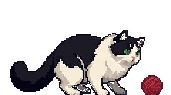

<p align="center">
  
</p>

<h1 align="center">OpenCat</h1>

<p align="center">
  <b>A cute floating desktop cat that talks to your AI.</b><br>
  Lightweight chat companion for <a href="https://github.com/nicepkg/openclaw">OpenClaw</a> — no browser, no Electron, just a cat on your screen.
</p>

<p align="center">
  
  
  
</p>

---

## Why OpenCat?

If you're running [OpenClaw](https://github.com/nicepkg/openclaw) as your AI gateway, you might find:

- **The official web panel is too cluttered** — you just want a quick, clean chat window
- **Telegram / WhatsApp bots need a VPN** if you're in mainland China
- **You want something that feels alive** — not another chat tab buried in your browser

OpenCat puts a pixel-art cat on your desktop. Click it, and a warm-toned chat window pops up. That's it. No browser, no VPN, no noise.

## Features

- **Floating cat widget** — always on top, draggable, with animated states (idle, thinking, talking, sleeping...)
- **Warm pastel chat UI** — clean, minimal, purpose-built for quick conversations
- **Streaming responses** — see the AI reply in real-time, token by token
- **Conversation history** — sessions are saved locally and browsable from the sidebar
- **Image attachments** — paste or drag images into the chat (clipboard + file picker)
- **Cross-platform** — Windows, macOS, Linux (native transparency on Windows, graceful fallback elsewhere)
- **Remote connection** — connect to an OpenClaw gateway on another machine via Tailscale or any network
- **Lightweight** — pure Python, ~100 KB installed, no Electron, no web runtime

## Quick Start

### Prerequisites

You need a running [OpenClaw](https://github.com/nicepkg/openclaw) gateway. OpenCat connects to it via WebSocket.

### Install

```bash
pip install git+https://github.com/Jacobzwj/opencat.git
```

### Run

```bash
opencat
```

OpenCat reads your gateway config from `~/.openclaw/openclaw.json` automatically.

### CLI Options

```bash
opencat --host 100.64.0.3    # Connect to a remote OpenClaw (e.g. via Tailscale)
opencat --port 18789          # Override gateway port
opencat --token your-token    # Override gateway token
opencat --debug               # Enable debug logging
```

## Development

```bash
git clone https://github.com/Jacobzwj/opencat.git
cd opencat
pip install -e .
opencat
```

## How It Works

```
┌──────────┐   WebSocket    ┌──────────────┐
│  OpenCat  │ ◄───────────► │  OpenClaw    │ ───► LLM API
│ (desktop) │   streaming   │  (gateway)   │
└──────────┘                └──────────────┘
```

OpenCat is a pure client — it connects to your self-hosted OpenClaw gateway over WebSocket, sends messages, and streams back responses. All AI logic, model selection, and API keys stay on the gateway side.

## Customizing the Cat

Cat animations are GIF files in `opencat/ui/assets/`. Replace them with your own pixel art:

| File | State |
|------|-------|
| `idle.gif` | Default state, hanging out |
| `thinking.gif` | Waiting for AI response |
| `talking.gif` | AI is streaming a reply |
| `done.gif` | Response complete |
| `sleeping.gif` | Idle for a while |
| `connecting.gif` | Connecting to gateway |
| `error.gif` | Connection error |

## License

MIT
