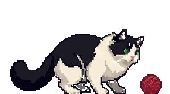
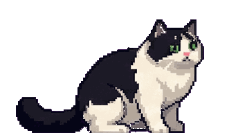
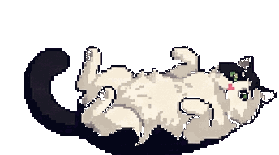
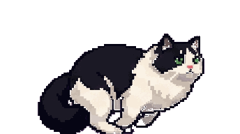
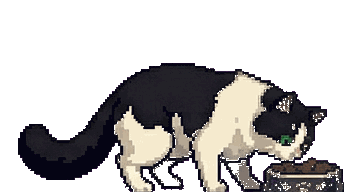
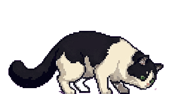
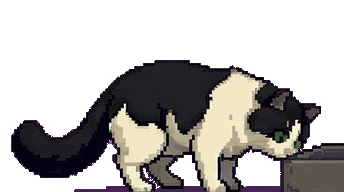
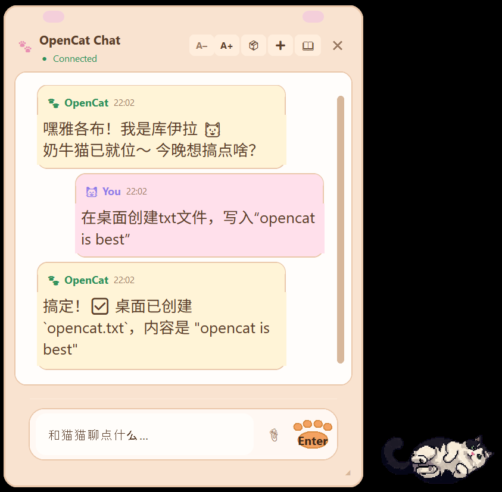
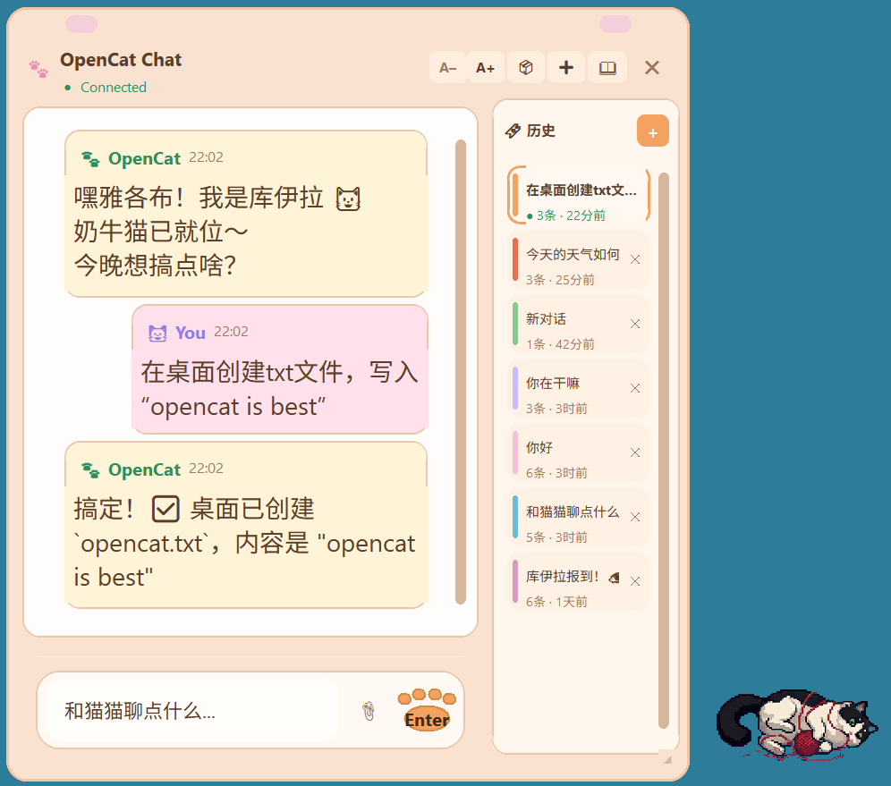

<p align="right">
  中文 | <a href="README.md">English</a>
</p>

<p align="center">
  
</p>

<h1 align="center">OpenCat — OpenClaw 桌面客户端</h1>

<p align="center">
  <b>给 <a href="https://github.com/openclaw/openclaw">OpenClaw</a> 套个可爱的壳 — 一样的指令，一样的 AI，只是更萌。</b><br>
  <code>pip install</code> 一行装好，<code>opencat</code> 一行启动。OpenClaw 能做的，这里都能做。
</p>

<p align="center">
  <a href="https://pypi.org/project/opencat/"></a>
  
  
  
</p>

<table align="center">
  <tr>
    <td align="center" colspan="4"><b>待机</b>（随机轮播）</td>
    <td align="center"><b>思考中</b></td>
    <td align="center"><b>完成</b></td>
    <td align="center"><b>睡觉</b></td>
  </tr>
  <tr>
    <td align="center"><br><sub>玩毛线球</sub></td>
    <td align="center"><br><sub>挠痒痒</sub></td>
    <td align="center"><br><sub>打滚</sub></td>
    <td align="center"><br><sub>奔跑</sub></td>
    <td align="center"><br><sub>吃饭</sub></td>
    <td align="center"><br><sub>拉屎</sub></td>
    <td align="center"><br><sub>睡觉</sub></td>
  </tr>
</table>

---

## 为什么选 OpenCat？

如果你在用 [OpenClaw](https://github.com/openclaw/openclaw) 作为 AI 网关，你可能会发现：

- **官方 Web 面板太臃肿** — 你只想要一个干净的聊天窗口
- **Telegram / WhatsApp 机器人需要翻墙** — 对国内用户不友好
- **你想要一个有生命感的东西** — 而不是浏览器里又一个聊天标签页

OpenCat 在你的桌面放一只像素猫。点它，弹出一个暖色调聊天窗口。就这么简单。不用浏览器，不用 VPN，没有多余的东西。

## 界面截图

<table>
  <tr>
    <td align="center"><b>聊天 + 猫猫</b></td>
    <td align="center"><b>历史记录侧栏</b></td>
  </tr>
  <tr>
    <td></td>
    <td></td>
  </tr>
  <tr>
    <td><sub>点击桌面猫猫打开聊天窗口。暖色系 UI，AI 回复实时流式显示。</sub></td>
    <td><sub>彩色书签式历史记录，随时切换或删除对话。</sub></td>
  </tr>
</table>

**工具栏：** `A-`/`A+` 调节字体大小 &nbsp;|&nbsp; 魔方切换 3D 猫猫 &nbsp;|&nbsp; `+` 新建对话 &nbsp;|&nbsp; 书本图标打开历史记录

## 功能特性

- **桌面浮动猫猫** — 始终置顶，可拖拽，带动画状态（待机、思考、对话、睡觉……）
- **暖色调聊天界面** — 简洁、干净，专为快速对话设计
- **流式回复** — 实时逐字看到 AI 的回答
- **对话历史** — 会话本地保存，侧栏随时浏览
- **图片附件** — 粘贴或拖拽图片到聊天框（支持剪贴板 + 文件选择）
- **跨平台** — Windows、macOS、Linux（Windows 原生透明，其他平台优雅降级）
- **远程连接** — 通过 Tailscale 或任意网络连接远程 OpenClaw 网关
- **轻量** — 纯 Python，安装约 100 KB，无 Web 运行时

## 聊天指令

OpenCat 支持 [OpenClaw](https://github.com/openclaw/openclaw) 原生指令 — 直接在聊天输入框中输入：

| 指令 | 说明 |
|------|------|
| `/status` | 查看当前 session 状态和 token 用量 |
| `/new` | 开始新对话（重置服务端 session） |
| `/compact` | 压缩上下文，节省 token |
| `/think <level>` | 设置思考深度 |
| `/stop` | 中止当前回复 |
| `/clear` | 清空本地聊天显示（不重置服务端 session） |
| `/help` | 显示所有可用指令 |

## 快速开始

### 前置条件

你需要一个正在运行的 [OpenClaw](https://github.com/openclaw/openclaw) 网关。OpenCat 通过 WebSocket 连接到它。

### 安装

```bash
pip install opencat
```

### 运行

```bash
opencat
```

OpenCat 会自动读取 `~/.openclaw/openclaw.json` 中的网关配置。

### 命令行参数

```bash
opencat --host 100.64.0.3    # 连接远程 OpenClaw（例如通过 Tailscale）
opencat --port 18789          # 覆盖网关端口
opencat --token your-token    # 覆盖网关 token
opencat --debug               # 开启调试日志
```

## 本地开发

```bash
git clone https://github.com/Jacobzwj/opencat.git
cd opencat
pip install -e .
opencat
```

## 工作原理

```
┌──────────┐   WebSocket    ┌──────────────┐
│  OpenCat  │ ◄───────────► │  OpenClaw    │ ───► LLM API
│  (桌面)   │   流式传输     │   (网关)     │
└──────────┘                └──────────────┘
```

OpenCat 是一个纯客户端 — 通过 WebSocket 连接到你自建的 OpenClaw 网关，发送消息并流式接收回复。所有 AI 逻辑、模型选择和 API Key 都在网关侧管理。

## 自定义猫猫

猫猫动画存放在 `opencat/ui/assets/` 目录，通过 `manifest.json` 映射。你可以替换成自己的像素画：

| 状态 | 触发时机 | 默认 GIF |
|------|---------|----------|
| **待机** | 已连接，等待用户输入。从动画池中随机轮播。 | `idle.gif`、`error.gif`、`connecting.gif`、`talking.gif` |
| **思考中** | 用户发送消息，等待 AI 回复 + 流式输出 | `thinking.gif`（吃饭） |
| **完成** | 回复结束，保持到下次发送消息 | `done.gif`（拉屎） |
| **睡觉** | 未连接到 OpenClaw | `sleeping.gif`（睡在箱子里） |

## 开源协议

MIT
